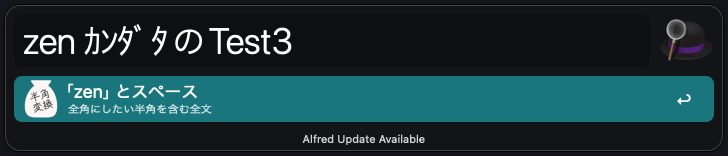
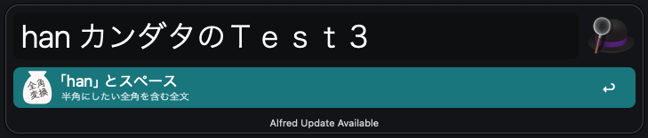

# 全角半角変換 Alfred workflow

## 概要

文字列に含まれる英数字、記号、カタカナを全角から半角に、または半角から全角に変換しクリップボードに記録する Alfred 向け workflow です。

## リリース方法

[GitHub の Releases](https://github.com/bvlion/zen-han-alfred-workflow/releases/new) から新しいタグを切ることで workflow が alfredworkflow ファイルを作成しリリースに添付してくれます。

## ダウンロード

[Releases](https://github.com/bvlion/zen-han-alfred-workflow/releases) の最新リリースから `zenhan.alfredworkflow` をダウンロードしてダブルクリックでインストールしてください。

### 必要な環境

- zsh
- ruby

※ どちらも Apple シリコン搭載の Mac に初期状態で入っているもので問題ありません。

## 使い方

### 全て全角にしたい場合

「zen 」の後に対象文字列を入力すると全て全角になります。

例: ｶﾝﾀﾞﾀのTest3 -> カンダタのＴｅｓｔ３

### 全て半角にしたい場合

「han 」の後に対象文字列を入力すると全て半角になります。

例: カンダタのＴｅｓｔ３ -> ｶﾝﾀﾞﾀのTest3

## 不具合報告

不具合の報告や改善案は [issue template](https://github.com/bvlion/zen-han-alfred-workflow/issues/new/choose) から作成ください。  
Pull request も歓迎しております。

## ライセンス

[Apache License 2.0](https://licenses.opensource.jp/Apache-2.0/Apache-2.0.html)
